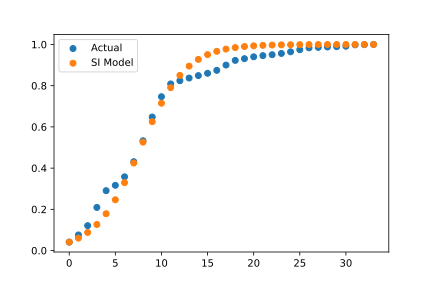
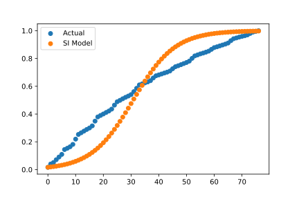

# 전염병모델을 영화관람객 데이터에 적용

## Motivation
영화에서 입소문의 효과가 클까?  
영화 누적관람객을 전염병 모델인 SI model 에 fitting 시킨다.  

## Result  
- 밀정, fitting 이 어느정도 되는 케이스.  

  

- 써니, 전혀 맞지 않는다.  

  

## Conclusion
- 영화의 전파는 입소문보다 광고의 효과가 크다. 

## Error 
- 크롤링 할 때, tab 누르는 간격이 짧으면 에러발생, IndexError 발생시 time.sleep 을 길게 잡으면 해결됨.

